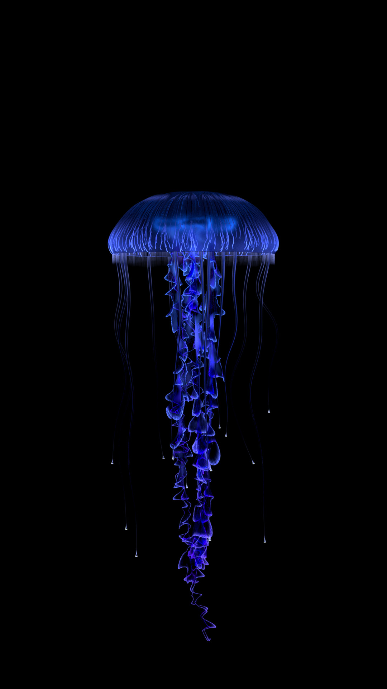
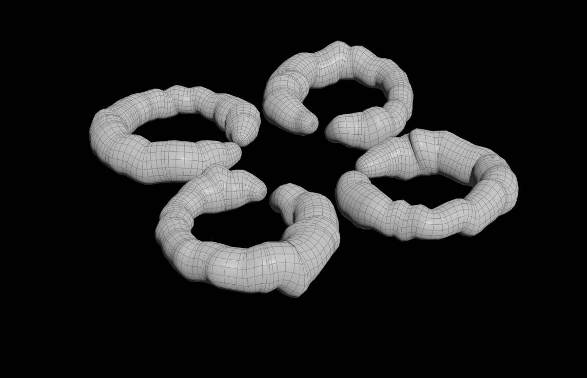
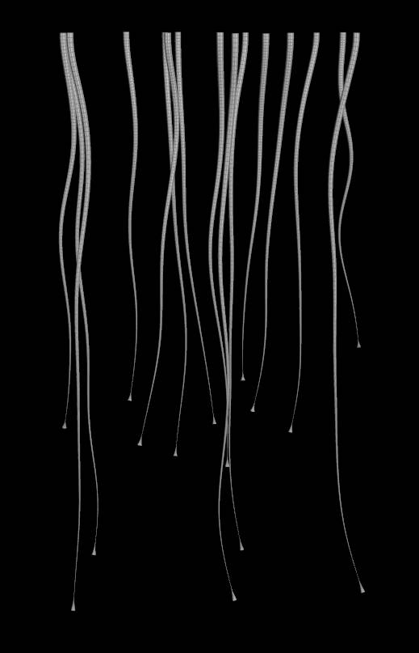
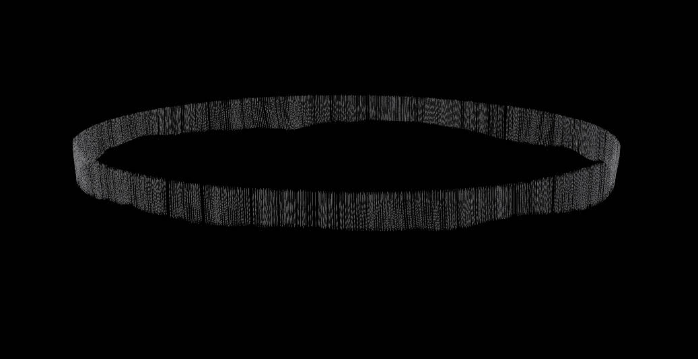

# Procedural Jellyfish
Created in Houdini, shaded and rendered with Karma.

# Modeling

INSERT VIDEO HERE

## Bell

### Procedurally animated using CHOPs 
1 function responsible for a constant y translation, then added to a sharped sin function to create the upward motion. For the bell shape animation, I used the same function for translation but with different range.

INSERT VIDEO HERE

## Arms
Used a for each loop for each arm so that I can use the iteration number to drive some parameters of armms to make it more random.
Then I spent 200 frames to preprosses and move the tentacles closer together

INSERT VIDEO HERE

## Veins

INSERT VIDEO HERE

## Organs
curve -> displace with noise -> sweep

## Tentacles
Used the side group generated by extruding to scatter the tentacles.

## Hair

# Shading
For the arms, I create my own 'curvev' attribute that has value 0 to 1 but horizontally across, kinda like a radial distance, perpendicular to curveu. Then used that to drive the shading to get a glow on only the rim edges. The I used the 'curvev' to drive a really high frequency noise to give the glow some detail, then finally mixing in a low frequency noise for a brighter color at the top.

The rest of the geometry shading is fairly simple, mostly using the curveu attributes to get a nice gradient across long tentacles and hair. I also used ray direction to get a fresnel on the tentacles.
